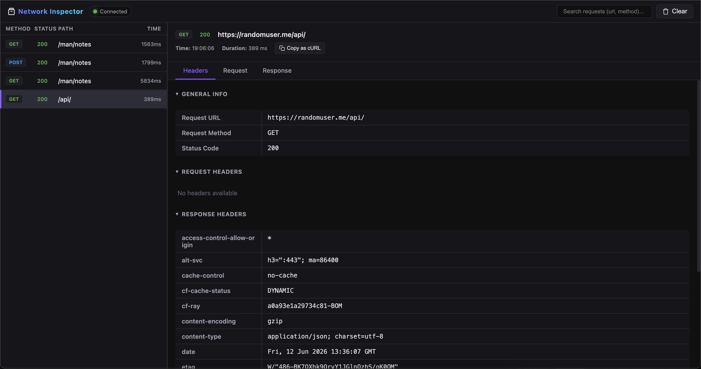

# @modhamanish/rn-network-logger

A premium, lightweight React Native Network Inspector that intercepts and logs network requests/responses in development mode and streams them via WebSockets to a web browser-based inspector dashboard.



---

## Features

- ⚡ **Zero Config**: Just import it, and it will automatically intercept global `fetch` and `XMLHttpRequest` requests.
- 🔗 **WebSocket Live Streaming**: Streams requests instantly to the local web inspector dashboard (running on port `19796`).
- 🚀 **Auto-starting Server**: Integrates with the React Native CLI to automatically start the inspector web server in the background when running dev commands like `react-native start`, `run-ios`, or `run-android`.
- 🖥️ **Web Dashboard**: View, filter, and inspect your network traffic in any browser at `http://localhost:19796`.
- 🤖 **Dynamic Metro Detection**: Dynamically retrieves the Metro server IP to support simulators, emulators, and physical devices without manual host configuration.
- 📦 **Axios Support**: Built-in Axios interceptors to support advanced request/response monitoring, with smart deduplication to prevent double logging.
- 🛡️ **Safe for Production**: All operations are guarded by `__DEV__` checking, ensuring zero performance overhead or package leakage in production builds.

---

## Installation

Install the package via npm or yarn:

```bash
# Using npm
npm install @modhamanish/rn-network-logger

# Using yarn
yarn add @modhamanish/rn-network-logger
```

Make sure you have `react` and `react-native` installed in your project (peer dependencies).

---

## Running the Inspector

### 1. Automatic Startup (Recommended)
Because of the React Native CLI configuration hook, the inspector web server starts automatically in the background on port `19796` as soon as you start your Metro bundler:
```bash
yarn start
# or yarn android / yarn ios
```
Once your app/bundler is running, simply open your browser and go to:
👉 **[http://localhost:19796](http://localhost:19796)**

### 2. Auto-Starting in Expo Projects
Since Expo CLI ignores React Native CLI configuration hooks, the background server will not start automatically on `npx expo start`. You can automate this by adding the inspector command to your script definitions in your project's `package.json`:

```json
"scripts": {
  "start": "rn-network-logger & expo start",
  "android": "rn-network-logger & expo start --android",
  "ios": "rn-network-logger & expo start --ios"
}
```
Starting your app via `yarn start`, `yarn ios`, or `yarn android` will now automatically launch the inspector server in the background!

### 3. Manual Startup
If you ever need to start the inspector server manually:
```bash
npx rn-network-logger
```
Then open **[http://localhost:19796](http://localhost:19796)**.

---

## Integration Guide

### 1. Automatic Zero-Config (Global Interceptor)

Simply import the package at the root entry point of your application (usually `index.js` or `App.tsx`). It will automatically spin up the WebSocket connection and start intercepting all network requests during development (`__DEV__`).

```javascript
// index.js or App.tsx (at the very top)
import '@modhamanish/rn-network-logger';
```

---

### 2. Integration with Axios (Optional)

If your project uses Axios and you want to ensure precise response durations, metadata logging, and handle error payloads cleanly, you can hook up the custom Axios interceptors. The logger automatically detects and deduplicates Axios logs from the global XHR listener.

```typescript
import axios from 'axios';
import networkLogger from '@modhamanish/rn-network-logger';

const axiosInstance = axios.create({
  baseURL: 'https://api.example.com',
});

// Add Request Interceptor
axiosInstance.interceptors.request.use(
  (config) => {
    return networkLogger.logRequest(config);
  },
  (error) => {
    return Promise.reject(error);
  }
);

// Add Response Interceptor
axiosInstance.interceptors.response.use(
  (response) => {
    return networkLogger.logResponse(response);
  },
  (error) => {
    networkLogger.logError(error);
    return Promise.reject(error);
  }
);
```

---

### 3. Manual Logging API

If you have custom API clients (like WebSockets, gRPC, or custom wrappers) and want to manually log actions to the inspector, you can use the generic logging methods:

#### Log Request manually:
```typescript
import networkLogger from '@modhamanish/rn-network-logger';

const requestId = networkLogger.logGenericRequest({
  url: 'https://api.example.com/data',
  method: 'POST',
  headers: { 'Content-Type': 'application/json' },
  body: { query: 'React Native' },
});
```

#### Log Response manually:
```typescript
import networkLogger from '@modhamanish/rn-network-logger';

networkLogger.logGenericResponse({
  id: requestId, // Pass the same ID returned from logGenericRequest
  status: 200,
  headers: { 'Content-Type': 'application/json' },
  body: { success: true },
  duration: 150, // in milliseconds
  isError: false,
});
```

---

## How It Works Under the Hood

1. **Metro IP Lookup**: On initialization, the logger reads `NativeModules.SourceCode.scriptURL` to locate the active Metro Packager host IP address, ensuring it works seamlessly on physical devices connected to the same Wi-Fi network.
2. **Global XHR Monkeypatching**: During development, it extends the global `XMLHttpRequest` to capture send payloads and read response blobs asynchronously.
3. **Queueing mechanism**: If the inspector server isn't open or connection drops, logs are safely queued in memory and flushed immediately when reconnection succeeds.
